# How to Make a Discord Bot in the Developer Portal?

Before you can dive into any Python code to handle events and create exciting automations, you need to first create a few Discord components:

1. An account
2. An application
3. A bot
4. A guild
You’ll learn more about each piece in the following sections.

Once you’ve created all of these components, you’ll tie them together by registering your bot with your guild.

You can get started by heading to Discord’s Developer Portal.

<h2>Creating a Discord Account</h2>

The first thing you’ll see is a landing page where you’ll need to either login, if you have an existing account, or create a new account:

If you need to create a new account, then click on the Register button below Login and enter your account information.
Once you’re finished, you’ll be redirected to the Developer Portal home page, where you’ll create your application.

<h2>Creating Application</h2>
An application allows you to interact with Discord’s APIs by providing authentication tokens, designating permissions, and so on.

To create a new application, select New Application:

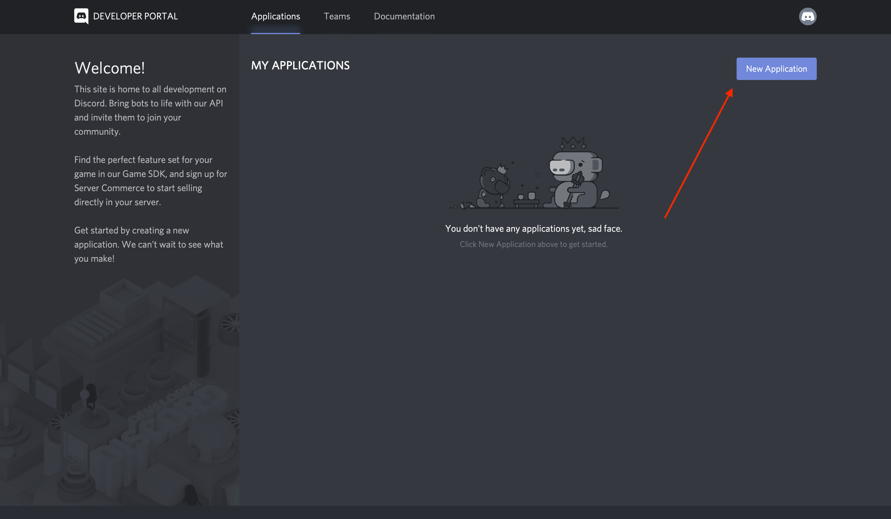

Next, you’ll be prompted to name your application. Select a name and click Create:

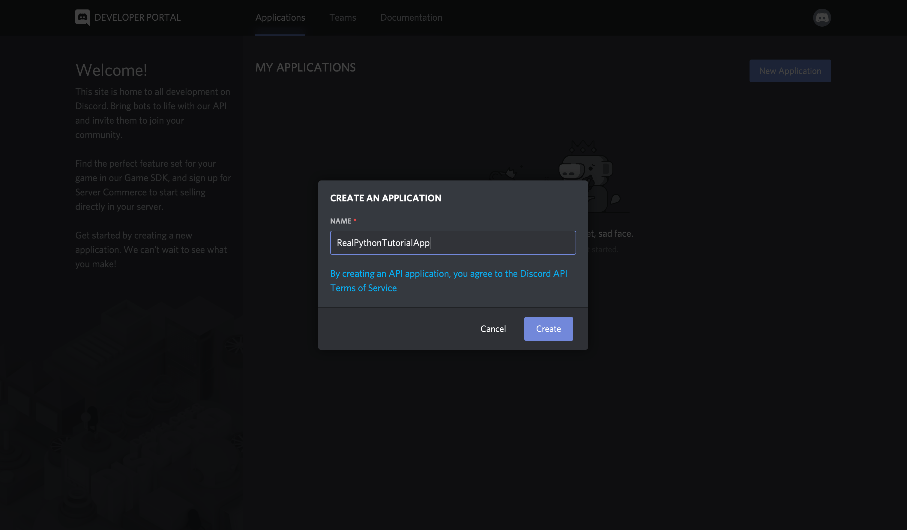

Congratulations! You made a Discord application. On the resulting screen, you can see information about your application:

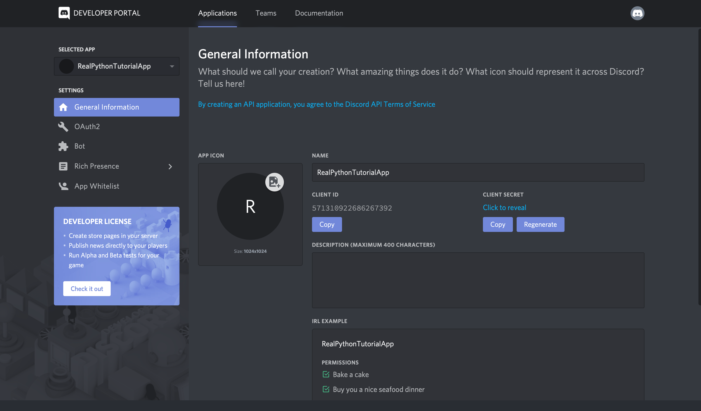

Keep in mind that any program that interacts with Discord APIs requires a Discord application, not just bots. Bot-related APIs are only a subset of Discord’s total interface.

However, since this tutorial is about how to make a Discord bot, navigate to the Bot tab on the left-hand navigation list.

<h2>Creating a Bot</h2>

As you learned in the previous sections, a bot user is one that listens to and automatically reacts to certain events and commands on Discord.

For your code to actually be manifested on Discord, you’ll need to create a bot user. To do so, select Add Bot:

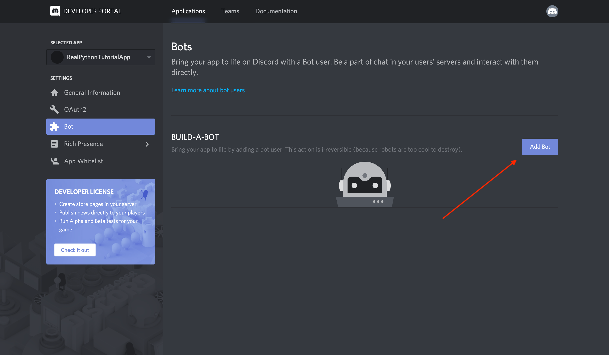

Once you confirm that you want to add the bot to your application, you’ll see the new bot user in the portal:

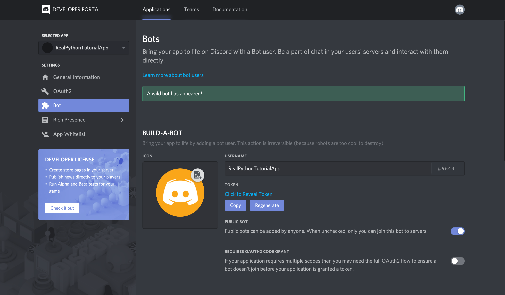

Notice that, by default, your bot user will inherit the name of your application. Instead, update the username to something more bot-like, such as RealPythonTutorialBot, and Save Changes:

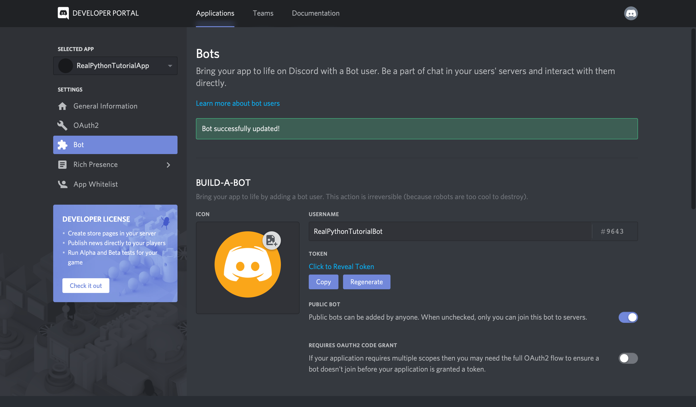

Now, the bot’s all set and ready to go, but to where?

A bot user is not useful if it’s not interacting with other users. Next, you’ll create a guild so that your bot can interact with other users.

<h2>Creating a Guild</h2>

A <b>guild</b> (or a <b>server</b>, as it is often called in Discord’s user interface) is a specific group of channels where users congregate to chat.

For example, say you want to create a space where users can come together and talk about your latest game. You’d start by creating a guild. Then, in your guild, you could have multiple channels, such as:

- General Discussion: A channel for users to talk about whatever they want
- Spoilers, Beware: A channel for users who have finished your game to talk about all the end game reveals
- Announcements: A channel for you to announce game updates and for users to discuss them

Once you’ve created your guild, you’d invite other users to populate it.

So, to create a guild, head to your Discord home page:

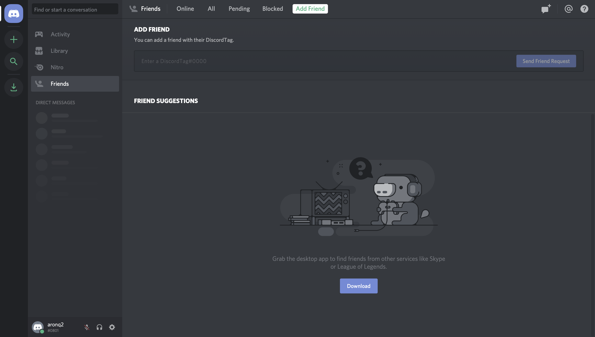

From this home page, you can view and add friends, direct messages, and guilds. From here, select the + icon on the left-hand side of the web page to Add a Server:

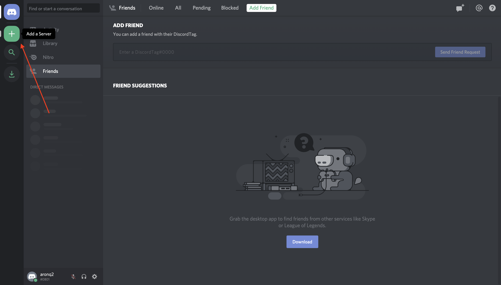

This will present two options, Create a server and Join a Server. In this case, select Create a server and enter a name for your guild.
Once you’ve finished creating your guild, you’ll be able to see the users on the right-hand side and the channels on the left:

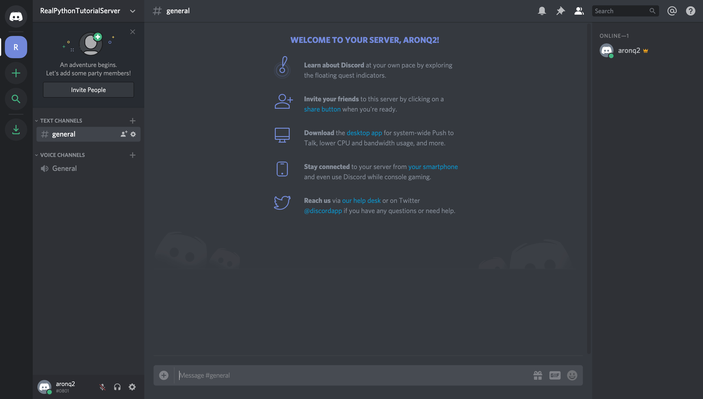

The final step on Discord is to register your bot with your new guild.

<h3>Adding a Bot to a Guild</h3>

A bot can’t accept invites like a normal user can. Instead, you’ll add your bot using the OAuth2 protocol.

To do so, head back to the Developer Portal and select the OAuth2 page from the left-hand navigation:

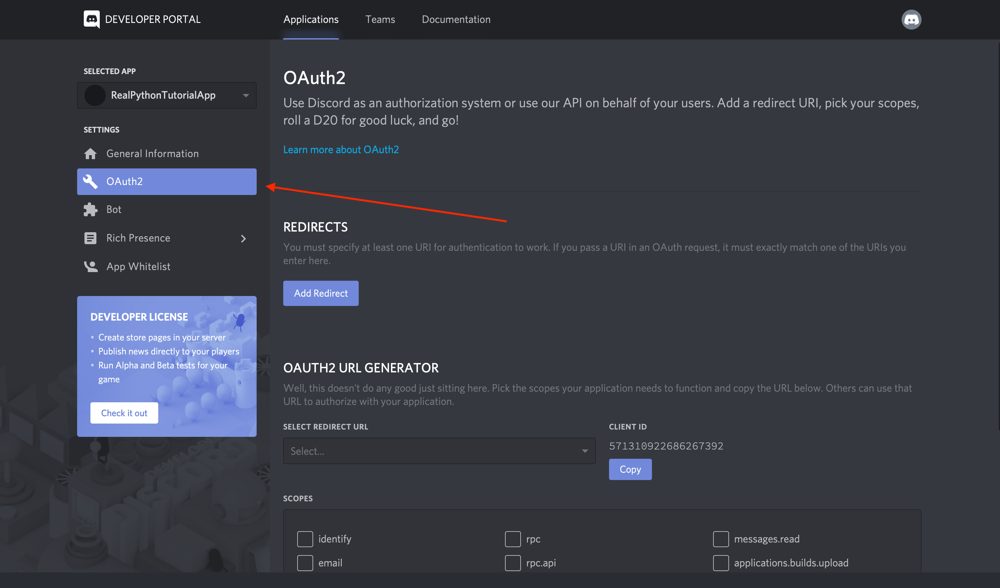

From this window, you’ll see the OAuth2 URL Generator.

This tool generates an authorization URL that hits Discord’s OAuth2 API and authorizes API access using your application’s credentials.

In this case, you’ll want to grant your application’s bot user access to Discord APIs using your application’s OAuth2 credentials.

To do this, scroll down and select bot from the SCOPES options and Administrator from BOT PERMISSIONS:

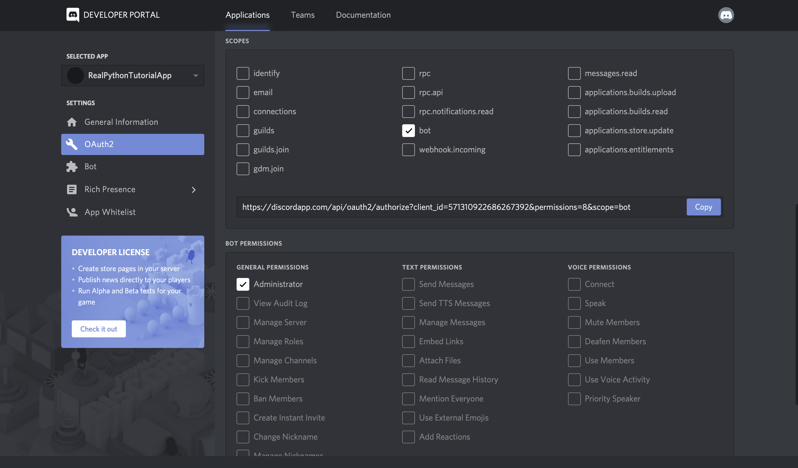

Now, Discord has generated your application’s authorization URL with the selected scope and permissions.

Select Copy beside the URL that was generated for you, paste it into your browser, and select your guild from the dropdown options:

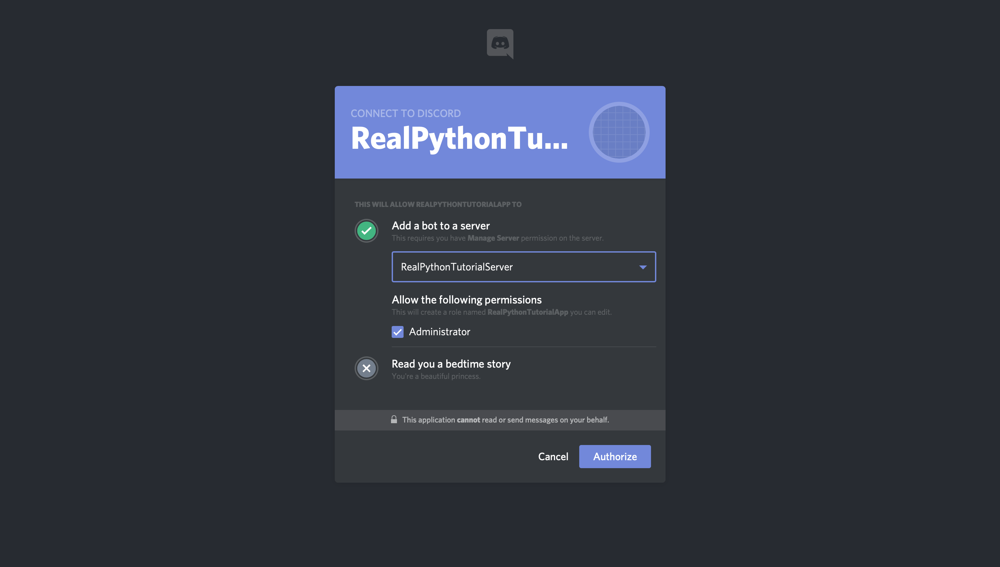

If you go back to your guild, then you’ll see that the bot has been added:

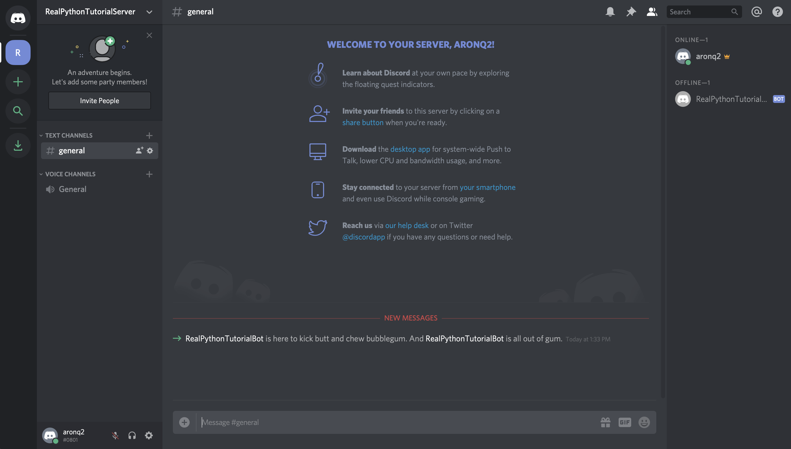

In summary, you’ve created:

- An <b>application</b> that your bot will use to authenticate with Discord’s APIs
- A <b>bot</b> user that you’ll use to interact with other users and events in your guild
- A <b>guild</b> in which your user account and your bot user will be active
- A <b>Discord</b> account with which you created everything else and that you’ll use to interact with your bot
Now, you know how to make a Discord bot using the Developer Portal. Next comes the fun stuff: implementing your bot in Python!

# Running Bot

First, you should import Discord.py.
$ pip install -U discord.py

And then, run bot.py
python bot.py

Now, you can enjoy your bot :)
